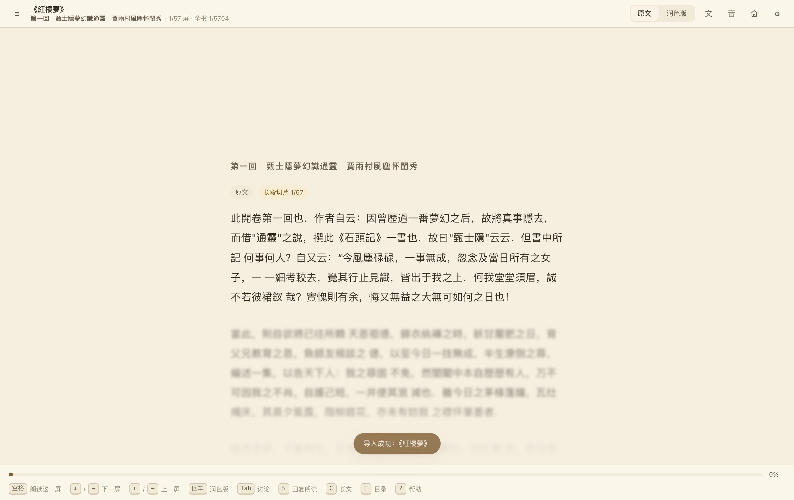
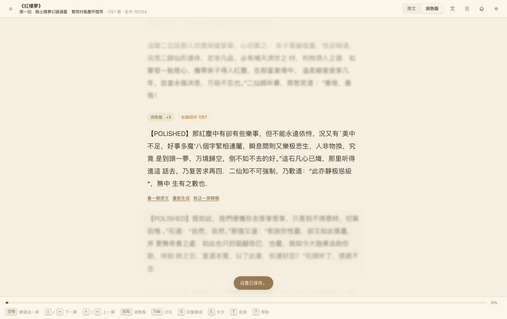
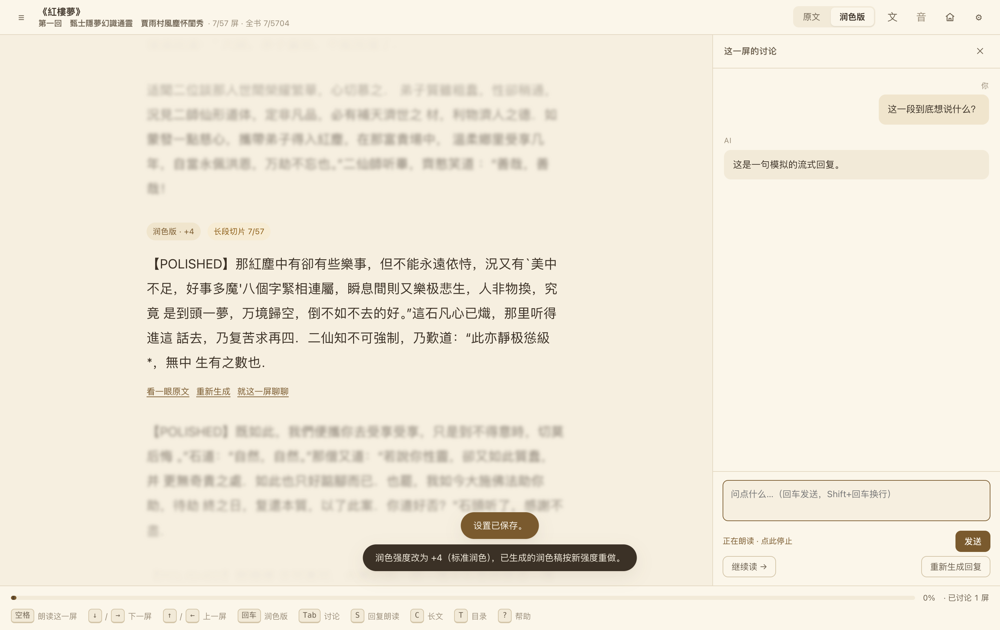
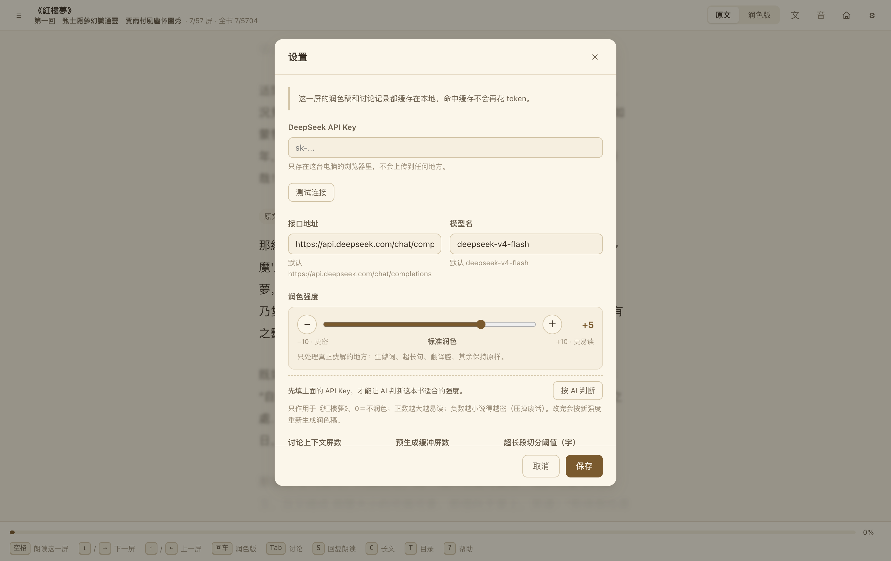
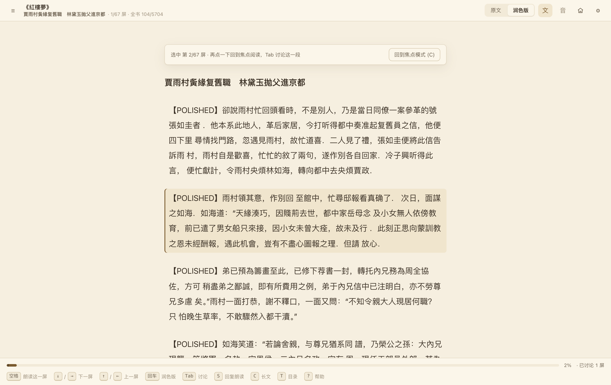
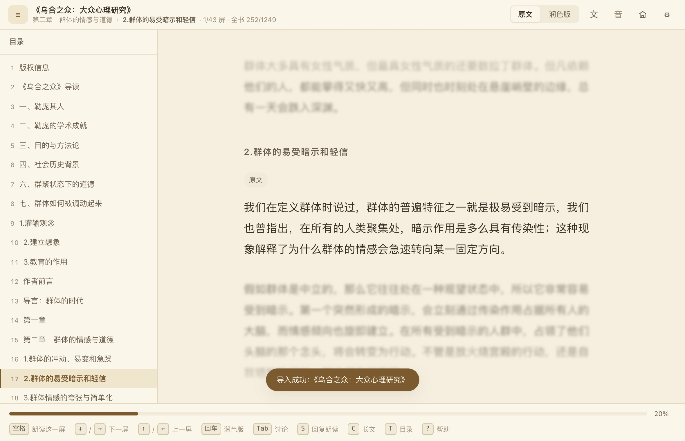
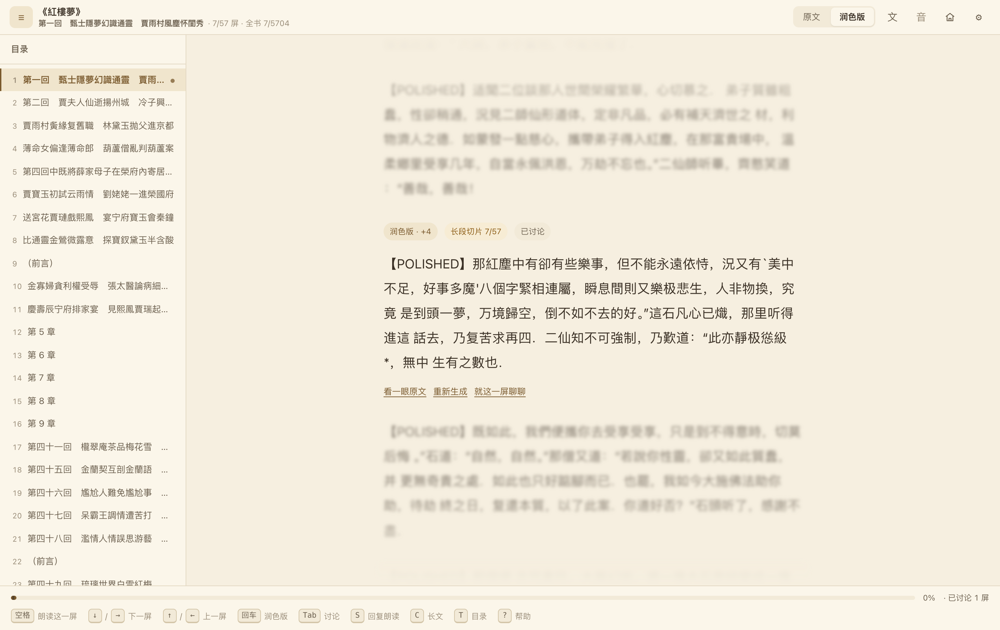

# AI 伴读

把一本读起来费劲的中文电子书（EPUB），按你的节奏**一屏一屏**读下去。

零后端、无构建、不装依赖 —— 双击 `main.html` 就能用。全部数据留在浏览器本地。

## 界面

| 书架 | 焦点阅读（原文） |
|---|---|
|  |  |

| 焦点阅读（润色版） | 逐屏讨论 |
|---|---|
|  |  |

| 设置 | 长文模式 |
|---|---|
|  |  |

| 顶栏：章节 → 小节 | 目录 |
|---|---|
|  |  |

## 它想解决什么

大多数「AI 阅读器」是把整本书丢给模型做摘要，读的人反而被架空了。

这个工具的立场相反：**书还是你自己读，AI 只负责把挡在路上的东西挪开。**

- 一屏只放约 160 字，注意力不用跟长段落较劲；
- 读起来吃力的地方，可以按你的水平把**这一屏**改写成更好读的版本；
- 读不懂就**就这一屏**开个讨论，不打断阅读流；
- 想听就按空格，读的正是屏幕上显示的那一版。

## 特性

- **焦点阅读**：当前屏居中，前后各 12 屏留在视野里（越远越虚化），上下文不丢。
- **顶栏显示「章节 → 小节」**：像 `第二章 群体的情感与道德 › 2.群体的易受暗示和轻信` —— 读到哪里、这一屏属于哪一章，一眼能看出来。EPUB 的章节目录被拍平成一维之后父子关系就丢了，所以这里按标题样式（卷/篇/部、`第X章`、`一、二、`、`1.` / `3）` 这类小节）还原出上一层；认不出层级的书就只显示自己，不会瞎猜。旧书不用重新导入。
- **AI 润色，强度 -10 ~ +10**：正数提高易读性（拆长句、补连接词、少用生僻词），负数提高信息密度（压废话），**0 = 不润色**。事实、数字、年份、专有名词、引语含义在**任何强度下都不许改**；原文里的引用角标（`[11]`、`[12]`、`[1-3]` 这类）在润色版里一律不显示，原文模式照旧保留。
- **每本书一个强度**：第一次打开这本书时 AI 会试读几段、自动给一个建议强度，之后随时可手调，也可一键调回 AI 的判断。
- **逐屏讨论**：右侧抽屉，流式回复；对话跟着屏走，翻回来还在。
- **长文模式**：整章连续排版，点某一段就吸附回焦点模式。
- **朗读**：空格朗读当前屏；顶栏的「音」＝翻屏自动朗读（灰着是关，点亮后每翻一屏就自己念）；引擎可选系统语音或本地 Qwen3-TTS（支持音色克隆）。
- **零后端**：书、进度、讨论记录都在浏览器 IndexedDB 里；API Key 也只存在本地。

## 快速开始

1. 克隆或下载本仓库。
2. 用 Chrome / Edge 打开 `main.html`（双击即可，不需要起服务器）。
3. 右上角「设置」里填 **DeepSeek API Key**（[申请地址](https://platform.deepseek.com/api_keys)），点「测试连接」。
4. 回到书架，把一本 **EPUB** 拖进去。

接口默认指向 `https://api.deepseek.com/chat/completions`，模型 `deepseek-v4-flash`。
也可以在设置里改 `baseUrl` 指向任意 **OpenAI 兼容**的接口（自建网关、其他厂商都行），只要支持 `stream: true`。

> 本仓库**不含**任何 API Key，也永远不会写入。请自行申请，Key 只保存在你自己浏览器的 IndexedDB 中。

### 快捷键

| 键 | 作用 |
|---|---|
| `空格` | 朗读当前屏 / 再按一次停止 |
| `↓` `→` `PageDown` | 下一屏 |
| `↑` `←` `PageUp` | 上一屏 |
| `回车` | 切换 原文 / 润色版 |
| `Tab` | 打开 / 收起讨论抽屉 |
| `S` | 开关「AI 回复朗读」 |
| `C` | 长文模式 |
| `T` | 目录 |
| `[` `]` | 上一章 / 下一章 |
| `?` | 快捷键帮助 |
| `Esc` | 收起面板 / 回到书架 |

长文模式下方向键和空格交还浏览器（正常翻页、正常滚动），不朗读。

## 可选的本地朗读服务

系统语音零依赖、打开即用，但音色机械。如果想要自然得多的中文朗读（9 个预设音色，还能克隆自己的声音），可以另外跑一个本地 Qwen3-TTS 服务：

```bash
cd tts-server
bash setup-qwen3.sh      # 建 venv、装 mlx-audio、下模型（约 1.3GB）
bash install-service.sh  # 装成登录项，开机自启、崩了自动拉起
```

然后在「设置 → 朗读 → 引擎」里选「本地语音」。

- 完全离线，服务地址 `http://127.0.0.1:8024`；
- 模型不常驻：打开页面加载、关掉页面约 8 秒后释放（4GB → 约 130MB）；
- 只支持 **macOS + Apple Silicon**（依赖 MLX）；
- 整个 `tts-server/` 目录可以直接删掉，删了自动退回系统语音。

细节、接口、性能实测和一堆 `launchd` 的坑都写在 [`tts-server/README.md`](tts-server/README.md)。

## 目录结构

```
main.html              入口，所有 script 标签按顺序写死在这里
assets/
  store.js             IndexedDB 封装（超时降级 localStorage）
  books.js             EPUB 解析 + 按屏切分（纯函数）
  prompts.js           提示词常量与拼装
  llm.js               DeepSeek 客户端（流式 + 重试 + 超时）
  tts.js               语音合成（系统语音 / 本地服务）
  ui.js                纯渲染，返回 DOM 节点
  app.js               状态机、快捷键、预生成调度
  vendor/jszip.min.js  EPUB 解压
tts-server/            可选的本地 TTS 服务（Python + MLX）
verify/                界面与功能的验证截图
需求文档.html           最初的需求与设计说明
```

## 一些设计取舍

- **不用 ES Module**：`file://` 协议下 `<script type="module">` 会被 CORS 拦掉、整片不执行。所以全部走经典 `<script src>` + IIFE + `window.XXX`。
- **不 fetch 本地文件**：读盘只能靠 `<input type="file">` / 拖放 + `FileReader`。
- **不依赖 CDN**：所有第三方依赖落在 `assets/vendor/`，离线可用。
- **渲染函数一律返回节点或数组**：空态也必须返回数组，否则上层 `forEach` 会炸。
- **讨论不给 AI 设知识边界**：注入的原文是背景补充，不是回答范围。唯一禁止的是把编造的细节说成是原文里的。

## 已知限制

- 只支持 **EPUB**。MOBI / AZW3 / PDF 请先用 [Calibre](https://calibre-ebook.com/) 转成 EPUB。
- 不做：后端、账号、云同步、翻译、划词问 AI、高亮笔记、token 统计、全书检索。
- 数据存在浏览器里，换浏览器或清空站点数据会丢。
- 本地朗读服务仅限 macOS Apple Silicon。

## License

[MIT](LICENSE)
